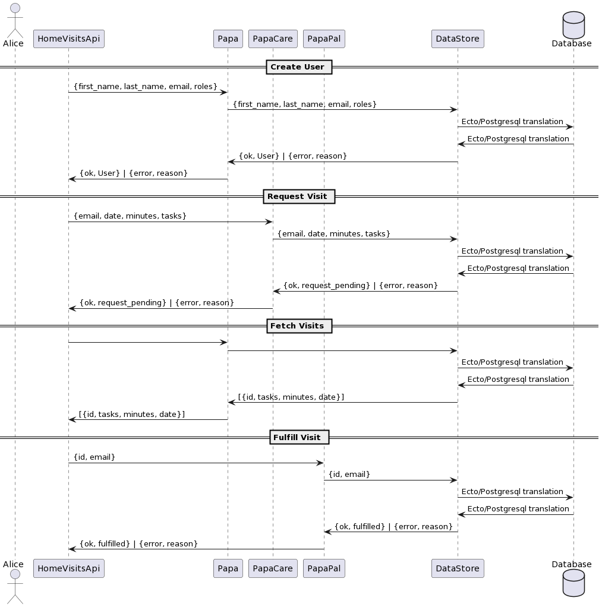

# Home Visits API

This is a standalone api for creating and reading member information

## Table of Contents

- [Introduction](#introduction)
- [Features](#features)
- [Getting Started](#getting-started)
- [API Documentation](#api-documentation)
- [Dependencies](#dependencies)
- [Contributing](#contributing)
- [License](#license)

## Introduction

This project aims to encapsulate the main goals as outlined in the papa challenge

## Features

- Some of the key features are as follows:
* A member can create an account with either or both of the papa roles ("member", "pal")
* A member is allowed to request visits, but not fulfill visits unless they are configured for the "pal" role
* When a user ("pal") fulfills a visit, the minutes are debited from the requester's account and credited to the pal's account - 15% fee
* If a member's account has a balance of 0 minutes, they cannot request any more minutes
* Allow visit browsing, so that a "pal" can choose their next visit to fulfill
* Allow for a faucet, so that accounts can get a pre-set amount of minutes (similar to blockchain testnets)

## Getting Started

These instructions will help you set up and run the project on your local machine. Follow these steps:

1. Clone the repository: `git clone https://github.com/cammcad/HomeVisitsAPI.git`
2. Install dependencies: `cd project-name && mix deps.get`
3. Configure the project: `the project depends heavily on ecto and postgesql, standard vanilla config`
4. Make sure postgresql is installed and running on port 5432
5. Run the migration to create the schema: `mix ecto.migrate`
6. Run the application: navigate to the root and run - `iex -S mix`

## Dependencies

Main dependencies used:

- [Postges](https://www.postgresql.org/): Relational database.
- [Ecto](https://hexdocs.pm/ecto): A database wrapper and query generator for Elixir.


## License

This project is licensed under the [Apache 2.0](LICENSE).


# Home Visits API




## Installation

INSTALL POSTGRES and ensure it's running on port 5432

## Option 1

- clone to your local machine and cd into the generated directory
- `mix deps.get`
- `mix deps.compile`
- `mix ecto.migrate`
- `iex -S mix`


## Option 2
```
defp deps do
  [
    {:phoenix, "~> 1.7.2"},
    {:jason, "~> 1.2"},
    {:plug_cowboy, "~> 2.5"},
    {:home_visits_api, git: "https://github.com/cammcad/HomeVisitsAPI.git"}
  ]
end
```

# Running Tests

To run the tests, make sure the test schema is created and then run the test
- `mix ecto_setup`
- `mix test`
